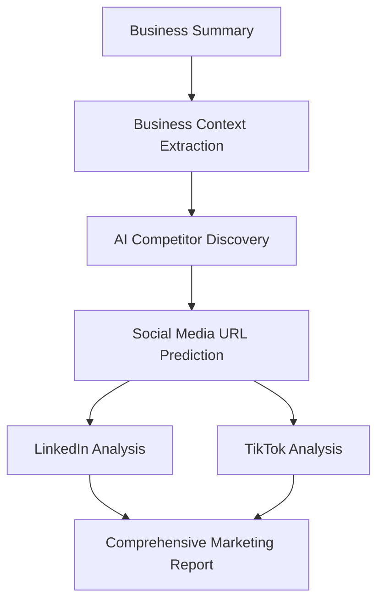

# Dynamic Competitor Discovery System

## Overview

The Dynamic Competitor Discovery System is an AI-powered solution that automatically identifies direct business competitors and extracts their LinkedIn and TikTok social media links for comprehensive marketing analysis.

## Features

### 🤖 AI-Powered Discovery
- Automatically identifies competitors based on business context
- Uses advanced AI analysis to find relevant industry players
- Intelligent business categorization and industry matching

### 🔗 Social Media Link Extraction
- **LinkedIn**: Automatically finds company LinkedIn pages
- **TikTok**: Discovers TikTok business profiles
- **URL Prediction**: AI-powered social media URL pattern prediction

### 📊 Comprehensive Integration
- Seamlessly integrates with existing marketing analysis system
- Replaces manual competitor input with intelligent discovery
- Maintains compatibility with existing LinkedIn and TikTok analysis agents

## API Endpoints

### 1. Dynamic Competitor Discovery
```
POST /marketing-strategy/discover-competitors
```

**Request Body:**
```json
{
  "max_competitors": 5,
  "use_existing_data": true,
  "business_summary": "Your business description..."
}
```

**Response:**
```json
{
  "success": true,
  "discovered_competitors": [
    {
      "id": "comp_1234",
      "name": "Competitor Name",
      "industry": "Technology",
      "description": "Competitor description",
      "linkedin_url": "https://linkedin.com/company/competitor",
      "tiktok_url": "https://tiktok.com/@competitor",
      "confidence_score": 0.9,
      "discovery_method": "AI analysis"
    }
  ],
  "summary": {
    "total_competitors": 5,
    "linkedin_profiles": 4,
    "tiktok_profiles": 3
  }
}
```

### 2. Enhanced Comprehensive Marketing Analysis
```
POST /marketing-strategy/comprehensive-analysis-with-discovery
```

**Request Body:**
```json
{
  "max_competitors": 5,
  "use_existing_data": true,
  "skip_discovery": false,
  "business_summary": "Optional business summary override"
}
```

**Features:**
- Automatic competitor discovery
- LinkedIn and TikTok analysis initiation
- Business context integration
- Comprehensive marketing insights

## Architecture

### Core Components

1. **CompetitorDiscoveryAgent** (`competitor_discovery_agent.py`)
   - Main AI agent for competitor discovery
   - Business context extraction
   - Social media URL prediction

2. **Integration Layer** (`main.py`)
   - API endpoints for discovery and analysis
   - Integration with existing marketing system
   - Session management for analysis tracking

3. **AI Models**
   - **Groq AI**: Business analysis and competitor identification
   - **Pattern Matching**: URL prediction algorithms
   - **Context Analysis**: Industry and business model understanding

### Data Flow



## Configuration

### Environment Variables
```bash
# Required for AI-powered discovery
GROQ_API_KEY=your_groq_api_key

# For LinkedIn analysis
LINKEDIN_CLIENT_ID=your_linkedin_client_id
LINKEDIN_CLIENT_SECRET=your_linkedin_client_secret
LINKEDIN_ACCESS_TOKEN=your_access_token

# For TikTok analysis (if needed)
TIKTOK_API_KEY=your_tiktok_api_key
```

## Usage Examples

### 1. Basic Competitor Discovery
```python
import requests

response = requests.post(
    "http://localhost:8000/marketing-strategy/discover-competitors",
    json={
        "max_competitors": 3,
        "business_summary": "AI-powered customer service platform for e-commerce"
    }
)

competitors = response.json()["discovered_competitors"]
for comp in competitors:
    print(f"{comp['name']}: {comp['linkedin_url']}")
```

### 2. Full Marketing Analysis with Discovery
```python
import requests

response = requests.post(
    "http://localhost:8000/marketing-strategy/comprehensive-analysis-with-discovery",
    json={
        "max_competitors": 5,
        "use_existing_data": True
    }
)

analysis_id = response.json()["analysis_id"]
print(f"Analysis started: {analysis_id}")
```

## Industry Support

The system supports automatic competitor discovery for various industries:

- **Technology**: SaaS, AI/ML, Software Development
- **E-Learning**: Online Education, Training Platforms
- **FinTech**: Digital Banking, Payment Solutions
- **Healthcare**: Telehealth, Medical Software
- **E-commerce**: Online Retail, Marketplaces
- **And more**: Extensible for any industry

## AI Discovery Process

### 1. Business Context Analysis
- Extract company name, industry, business model
- Identify target market and key services
- Analyze unique value propositions

### 2. Competitor Identification
- AI-powered competitor research
- Industry-specific competitor databases
- Real-time competitor discovery

### 3. Social Media Link Prediction
- LinkedIn company URL pattern matching
- TikTok profile URL prediction
- Validation and confidence scoring

## Output Files

The system saves discovery results to:
- `agents/output/competitor_discovery_output.json`

Contains:
- Discovery metadata
- Complete competitor information
- Social media links
- Confidence scores

## Error Handling

### Fallback Mechanisms
1. **AI Failure**: Industry-based competitor lists
2. **No Discovery**: Manual competitor input support
3. **Invalid URLs**: Pattern-based URL correction

### Common Issues
- **GROQ_API_KEY not set**: Fallback to pattern matching
- **No business summary**: Requires manual input
- **Rate limiting**: Automatic retry with delays

## Testing

Run the test suite:
```bash
cd backend
python test_competitor_discovery.py
```

Tests include:
- Basic competitor discovery
- Enhanced comprehensive analysis
- Error handling scenarios
- Integration verification

## Performance

### Typical Discovery Times
- **Basic Discovery**: 10-30 seconds
- **With Social Media Links**: 15-45 seconds
- **Full Analysis**: 2-5 minutes

### Rate Limits
- **Groq AI**: Respects API rate limits
- **Social Media APIs**: Built-in delays
- **Discovery Agent**: Configurable timeouts

## Future Enhancements

### Planned Features
1. **Real-time Competitor Monitoring**
2. **Advanced Social Media Platform Support** (Instagram, Facebook, X/Twitter)
3. **Competitive Intelligence Dashboard**
4. **Automated Competitor Content Analysis**
5. **Industry Trend Integration**

### Roadmap
- Q1 2025: Advanced URL validation
- Q2 2025: Real-time monitoring
- Q3 2025: Enhanced AI models
- Q4 2025: Competitive intelligence suite

## Support

For issues or questions:
1. Check the logs in `backend/api.log`
2. Verify environment variables are set
3. Test with the provided test script
4. Review the agent output files

## Contributing

When contributing to the competitor discovery system:
1. Follow the existing agent architecture
2. Add comprehensive error handling
3. Include fallback mechanisms
4. Update documentation
5. Test with various business types
